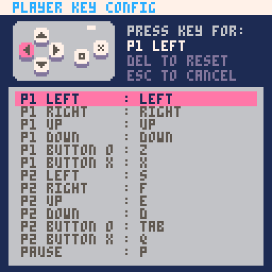
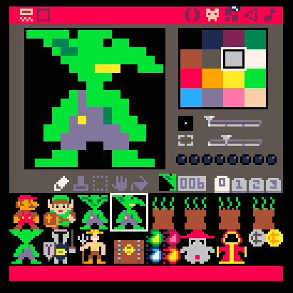
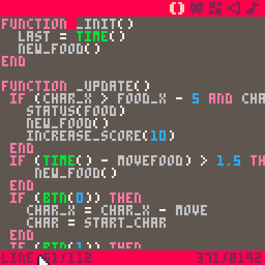

# BOSS Presentation

## About Presentation

The following materials are for use in the [Pico-8](http://www.lexaloffle.com/pico-8.php) workshop at [Big Orange Stem Saturday](https://www.lib.utk.edu/outreach/soil/b-o-s-s/) on April 7, 2018.

The game we're building is called [**Troll 2: The Movie: The Game** and can be found here](https://www.lexaloffle.com/bbs/?pid=51180&tid=31068).

## About Pico-8

[PICO-8](http://www.lexaloffle.com/pico-8.php) is a fantasy console for making, sharing and playing tiny games and other computer programs. When you turn it on, the machine greets you with a shell for typing in Lua commands and provides simple built-in tools for creating your own cartridges.

Some technical specifications:

* The display is 128 x 128 pixels
* The display supports 16 colors
	* 
* Can support 128 8x8 sprites per game
* Controller support for 2 players:
	* a D-Pad (Up + Down + Left + Right)
	* 2 buttons (A + B)
	* a Pause Button
	* 

## Other Helpful Links

* [Pico-8 Zines](http://pico8fanzine.bigcartel.com/): Pico-8 zines are awesome 48-page fanzines made by and for PICO-8 users.
* [Pico Awesome List](https://github.com/felipebueno/awesome-PICO-8): A curated list of awesome PICO-8 resources, carts, tools, and more.
* [A Pico-8 Space Shooter in 16 Gifs](https://ztiromoritz.github.io/pico-8-shooter/): Learn how to write a spaceshooter in Pico-8 in 16 gifs.
* [Pico-8 Cheat Sheet](https://ztiromoritz.github.io/pico-8-spick/index_en.html): Awesome Cheat sheet for Pico-8.
* [PocketCHIP](https://getchip.com/pages/pocketchip): like a GameBoy, but for Pico-8.

## What Are We Making?

Today, we're going to be building a game called "[Troll 2: the Movie: the Game](https://www.lexaloffle.com/bbs/?tid=31068)".  It's a very basic game that uses a few basic programming concepts.  Let's check it out before we get started.

## Starting Up Pico-8

From the Apple Dock, click the Pico-8 icon. Once Pico-8 has booted, type **SPLORE**. Scroll to right and find Search. Type **"nilbog"** and press return. Click **"Nilbog."**  This is game we will be recreating today.  Specifically, we need this to have the sprites created by our own Shawn O'Brien.

Once you've had enough of this game, press **ESC** to enter the editor.

## The Sprite Editor



The sprite editor is where you create your graphics in Pico-8.

Sprites are computer graphics that may be moved on-screen and otherwise manipulated as a single entity.In computer graphics, a sprite is a two-dimensional bitmap that is integrated into a larger scene.

In Pico-8, you can create sprites in the editor pixel by pixel.

Once your pico editor is running, you can get to the Sprite Editor by Clicking the second icon in from the left on the upper-right-hand side of the screen.

The protagonist of our game will be the Goblin. Let's click the Goblin next to Link.  When you do this, you should see the number **004**.  This number is important (specifically the 4).  We will use the number to tell which sprite to associate with our character.

Notice that when you click the Sprite, you only get the 8 x 8 upper left-hand corner of the sprite.  If you use the slider bar beneathe the color pallette, your sprite is now 16 x 16 but the sprite number is still 4.  We will talk about how this works later.
 

## The Code Editor

This is where we will write all the code to control what happens in our game.

While it can be hard to read due to the 128 x 128 screen size, the code editor is nice because it helps you spot errors in your code via syntax highlighting.



Let's delete all the code here before we start (don't cheat).

## [One:  Variables](examples/part_1.lua)

**Variables** are the first programming concept we will discuss.  Variables have a name and associated value.  While the name stays the same, the value can change.

To get started, let's write some variables to represent our character and assign some starting values.  To display your character, we'll need a variable to assign the sprite and its x and y positions.


##### Our New Code Should Look Like:

```lua
char_spr = 4
char_xpos = 60
char_ypos = 60
```

## [Two: Functions and Special Function _init()](examples/part_2.lua)

In programming, a **function** is a block of code that performs a specific task when its called. Functions are important because they allow you to repeat the same tasks without having to rewrite any instructions.

We will write and call several functions throughout the course of our game.

In Pico-8, there are 3 special functions that are called **automatically** if defined by the user. Each of these starts with a single underscore. 

The first special function is _init().  _init() is called once on program start up.

Let's write an _init() function and make it clear the screen when the game starts.  To do this, we will **call** a predefined function called cls().

Pico-8 has several [predefined functions]() that you can use.

##### Our New Code Should Look Like:
```lua
function _init()
  cls()
end
```

## [Three: Functions and Special Function _draw()](examples/part_3.lua)

Another special function in Pico-8 is called **_draw()**. Like _init(), _draw() is called automatically during program execution, however it is called 30 times per second (by default) rather than once at startup.  _draw() is where we will add our sprite graphics and any other messages to the screen.

Let's define our new _draw() function and use it to draw our character. To do this, we will use a predefined function called [spr()](http://pico-8.wikia.com/wiki/Spr) which is used specifically to draw sprites to the screen. 

Functions can take special instructions called parameters by passing comma-separated values inside the parentheses. The spr() function accepts 7 parameters, but not all are required.  The first 3 are sprite number, x postion, and y position. Let's draw our sprite.

##### Our New Code Should Look Like:
```lua
function _draw()
  spr(4, 60, 60)
end
```

If we execute our program now, it will display our sprite, but this isn't great.  First, we can make our function more dynamic by utilizing our variables:

#### Our New Code Should look like this:

```lua
function _draw()
  spr(char_spr, char_x, char_y)
end
```
 
This is more dynamic, but it only displays part of the sprite.  We can display the full sprite by increasing the size.  By default, sprites are 8 by 8 chunks.  We can increase to 16 by 16 and show our whole sprite by adding 2 more parameters:

#### Our New Code Should look like this:

```lua
function _draw()
  spr(char_spr, char_x, char_y, 2, 2)
end
```

## [Four: Tables](examples/part_4.lua)

You're probably wondering why we didn't set a variable for our height and width and maybe we should do that.  Before we do that though, you might of noticed our code is already getting messy. Every variable we've defined is about our character, but depending on how you've named your variables, that may not be obvious.

To fix this, let's convert all our existing variables to a table called char.  Tables can have properties in the form of key value pairs.  Confused yet?  Let's see an example:

#### Our New Code Should look like this:

```lua
char = {
  spr_val = 4,
  x_pos = 60,
  y_pos = 60,
}
```

Now that we've defined our table, we can update our function_draw() to use it:

```lua
function _draw()
  spr(char.spr_val, char.x_pos, char.y_pos, 2, 2)
end
```

Let's go ahead and add a sprite height and width as well as a few more key value pairs to our char table:

#### Our New Code Should Look Like This

```lua
char = { 
    spr_val = 4,
    x_pos = 60,
    y_pos = 60,
    spr_ht = 2,
    spr_wt = 2,
    health = 4,
}

```

## [Five: Data Types](examples/part_5.lua)

So far, all of our values in our variable declarations have looked like this:

```lua
spr_val = 4
```

This type of value in Pico-8 is a special data type called a number. Numbers are formatted a specific way and can have special operations that can be applied.

For instance, in Pico-8 you can add, subtract, multiply, and divide numbers:

#### Example
```lua
1 + 1
2 - 1
4 * 8
4 / 2
x = 1
y = 2
x + y
```  

Pico-8 has a few other data types.  Let's add 2 to our char table:

#### Our code should look like:

```lua
char = {
 spr_val = 4,
 x_pos = 60,
 y_pos = 60,
 spr_ht = 2,
 spr_wt = 2,
 health = 4,
 name = "grishnakh",
 spr_flipx = false,
}
```

We've now given our character a name.  The name is wrapped in quotes.  In Pico-8, this data type is called a string. Strings have their own features and are always wrapped in quotes.

We've also added another property called spr_flipx.  It's set to false.  In Pico-8 this is called a boolean.  Booleans are always true or false and have their own rules and features.

The spr_flipx property will be used to make our goblin look to the left and right rather than having 2 sprites.  In Pico-8, you are limited to 128 8x8 sprites.

Let's add this to our _draw().

#### Our code should look like:

```lua
function _draw()
  spr(char.spr_val, char.x_pos, char.y_pos, char.spr_ht, char.spr_wt, char.spr_flipx)
end
```

## [Six: Special Function _update()](examples/part_6.lua)

Our final special function is** _update()**. Like _draw(), update is call 30 times per second (by default) automatically during program execution. The intended purpose of _update() is to test for user inputs (button presses), perform all of the calculations to advance the state of the game, and update the game's data structures with the results. Typically, this function does not update the display, though it may initiate sound effects (sfx()) and music (music()).

In programming, conditional statements test whether a statement is true or false.  In this section, we will use conditionals to test if a user presses a button.  It they do press a button, we will write code to move our character in a direction. In Pico-8, a conditional block can have an if block (required), multiple elseif blocks (optional), and an else block (optional). For now, we will just use ifs.  The block must end with the keyword end.

In Pico-8, you only have a few inputs.  You can have 2 players, but they both only have inputs for Up, Down, Left, Right, A, and B. These are detected with a predefined funciton called btn().  Lets use btn(), _update, and conditionals to change our sprite when someone presses left.


#### Our code should look like:
```lua
function _update()
    if (btn(0)) then
        char.spr_num = 6
        char.flipx = true
    end
end
```

Let's repeat for right, up, and down.

```lua
function _update()
  if (btn(0)) then
    char.spr_num = 6
    char.flipx = true
    char.xpos = -1
  elseif (btn(1)) then
    char.spr_num = 6
    char.flipx = false
    char.xpos = 
  elseif (btn(2)) then
    char.spr_num = 32
    char.flipx = false
  elseif (btn(3)) then
    char.spr_num = 4
    char.flipx = false
  end
end
```

#### [Seven: Movement, Operators, and Methods]()

Our goblin still isn't moving.  We need to add some code to do this.  


Our char table already tracks the x and y coordinates for our character.  Let's add some code so these change when someone presses the up, down, left, or right buttons. 
```lua
function _update()
    if (btn(0)) then
        char.spr_num = 6
        char.flipx = true
        char.x_pos -=  1
    elseif (btn(1)) then
        char.spr_num = 6
        char.flipx = false
        char.xpos += 1
    elseif (btn(2)) then
        char.spr_num = 32
        char.flipx = false
        char.y_pos += 1
    elseif (btn(3)) then
        char.spr_num = 4
        char.flipx = false
        char.y_pos -= 1
    end
end
```

-= an d+= are special operators in Pico-8 that allow you to add or remove a value from your assigned variable.

Tables can also contain functions.  Other languages may call these methods.  Let's add a function to our table that allows our Goblin to teleport.

#### Our Code Should Look Like This:
```lua
char = {
    spr_val = 4,
    x_pos = 60,
    y_pos = 60,
    spr_ht = 2,
    spr_wt = 2,
    health = 4,
    name = "grishnakh",
    spr_flipx = false,
    teleport = function(self)
                self.x_pos = flr(rnd(110)) + 10
                self.y_pos = flr(rnd(110)) + 5
            end;
}
```

Three things here:

1. We need this keyword self as a parameter for our function.  Basically, it tells Pico-8 that we're talking about this instance of char and that we need all of it's properties available to us.
2. When we call properties inside of char, we need to specify this instance of char. That's why we say self.y_pos rather than char.y_pos.
2. We're using two new predefined functions: flr() and rnd().  flr() returns a whole number. rnd() gives us as random number up to the number.  we can start from a specific value by adding that value to the end.  


Now let's bind our method to the b button.

#### Our Code Should Look Like This:
```lua
function _update()
    if (btn(0)) then
        char.spr_num = 6
        char.flipx = true
        char.x_pos -=  1
    elseif (btn(1)) then
        char.spr_num = 6
        char.flipx = false
        char.xpos += 1
    elseif (btn(2)) then
        char.spr_num = 32
        char.flipx = false
        char.y_pos += 1
    elseif (btn(3)) then
        char.spr_num = 4
        char.flipx = false
        char.y_pos -= 1
    elseif (btn(4)) then
        char.teleport()
    end
end
```
